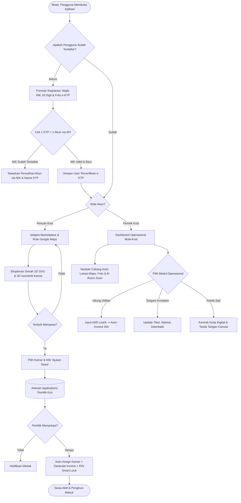
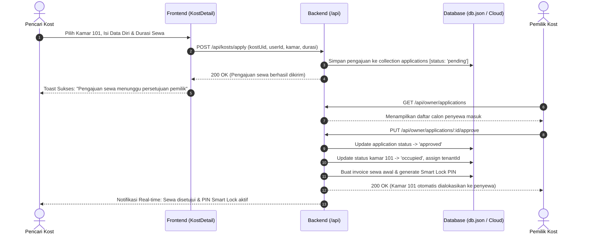
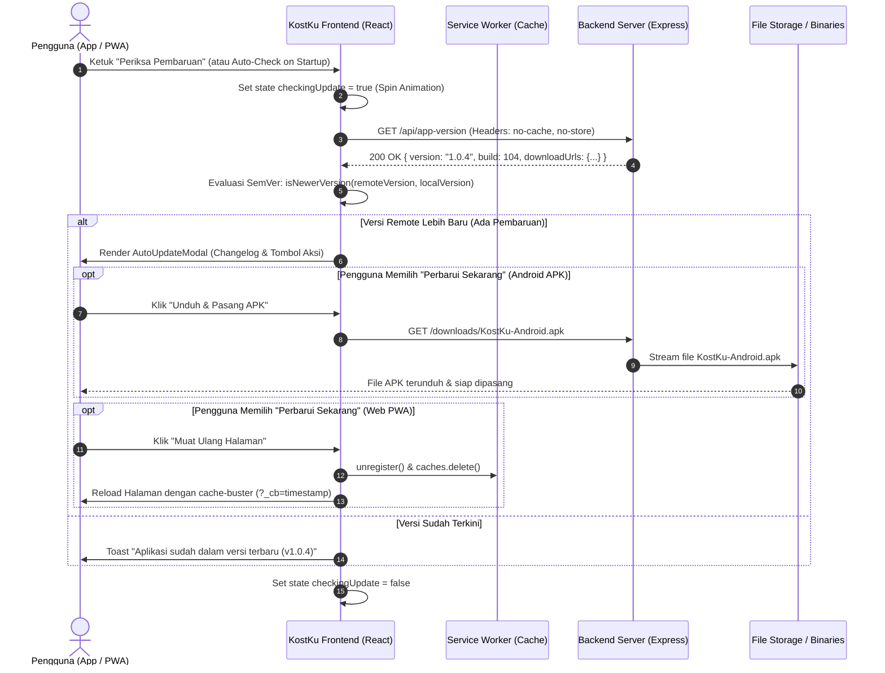

# Blueprint Produk & Arsitektur UX KostKu: Bedah Mendalam Sistem Manajemen & Marketplace Kost Pintar (AI Spatial Edition)

**Peran**: Senior Product Manager & Lead UX Architect  
**Subjek**: **KostKu (Sistem Manajemen & Marketplace Pencarian Kost Pintar Multi-Platform)**  
**Versi Target**: **v1.0.4 Enterprise Production** (Web PWA, Android Capacitor APK, Windows Electron)  
**Tanggal Pembaruan**: Oktober 2026  

---

## BAGIAN 0: DRAFT BALASAN CEPAT UNTUK DISKUSI TIM
*(Dapat langsung disalin dan dikirimkan ke grup diskusi proyek)*

> "Halo, selamat pagi! Terima kasih sudah menginisiasi diskusi. Agar proyek kita terarah, memiliki diferensiasi kuat, dan pembagian tugasnya jelas sejak hari pertama, berikut rincian kerangka kerja yang sudah dirumuskan:
>
> 1. **Topik Proyek**:  
>    **KostKu** — Ekosistem Digital Kost Terpadu Dua Sisi (*Two-Sided Platform*): Marketplace Pencarian Kost Cerdas Berbasis Denah Interaktif 2D/3D dengan AI Vision Room Scanner untuk Pencari Kost, terintegrasi langsung dengan Dashboard Manajemen Operasional (Penghuni, Tagihan/Listrik kWh, Komplain, Multi-Cabang Properti, Kontrak Staf) untuk Pemilik Kost.
>
> 2. **Bahasa Pemrograman & Tech Stack**:  
>    - **Frontend**: JavaScript (ES6+), React 18, Vite, Lucide Icons, Recharts (visualisasi analitik keuangan).
>    - **Styling**: Tailwind CSS utility class + Glassmorphic Design System (CSS Variables).
>    - **Grafis & Interaksi 2D/3D**: SVG Blueprint Engine (Denah Arsitektural 2D) & Three.js / Canvas Engine (3D Isometric Cutaway Room & Blue Hour Facade).
>    - **Backend & Database**: Node.js, Express REST API, SQLite / Structured Local JSON DB (`db.json`) dengan caching layer in-memory serverless.
>    - **Cloud & Auth**: Supabase Cloud Sync (PostgreSQL remote) + Google OAuth 2.0 + Anti-Bot e-KTP Verification.
>    - **Multi-Platform Container**: Capacitor (Android Debug/Release APK) & Electron (Windows Desktop `.exe`).
>
> 3. **Keamanan & Verifikasi Resmi**:  
>    - Sistem **Anti-Bot 1 KTP 1 Akun** dengan validasi NIK 16 digit terdaftar, unggah foto fisik e-KTP, dan pemulihan akun otomatis via NIK & Nama Resmi.
>    - Verifikasi Buka Kost wajib menyertakan koordinat GPS, tautan Google Maps langsung, foto tampak depan, dan foto interior kamar tidur asli.
>
> 4. **Tata Kelola & Standar Operasional Prosedur (SOP)**:  
>    - **SOP Maintenance Terjadwal**: Eksekusi jam sepi 01.00–04.00 WIB, pasang banner 24 jam sebelumnya, full backup DB & storage pra-maintenance, dan uji fungsi vital pasca-maintenance.
>    - **SOP Server Down & Error Kritis**: Monitoring otomatis < 2 menit, failover ke halaman statis perbaikan darurat < 5 menit, rollback instan < 15 menit jika bug dari rilis terakhir, dan post-mortem report 1x24 jam.
>    - **SOP Penanganan Komplain Pengguna**: Satu pintu aduan WhatsApp & formulir tiket; klasifikasi *Mendesak* (uang/akses kamar) SLA respons 15–30 menit; *Biasa* SLA 1x24 jam; siklus respons 3 langkah (Akui & Empati -> Estimasi Waktu -> Konfirmasi Penuntasan).
>
> Dokumen spesifikasi teknis dan bedah arsitektur produk lengkapnya terlampir di bawah ini."

---

## 1. VALUE PROPOSITION & CUSTOMER HOOK

### 1.1 Masalah Utama yang Diselesaikan & Hook Pemicu Pertama
Pasar sewa properti kos-kosan di Indonesia memiliki dua masalah fundamental (*asymmetrical friction*):

1. **Sisi Pencari Kost (Anak Rantau / Mahasiswa / Profesional Muda)**:  
   - *The Reality Gap*: Foto listing seringkali menggunakan lensa *ultra-wide angle* yang menipu, menyamarkan sirkulasi udara yang pengap, atau tidak menampilkan letak pasti kamar mandi dalam dan jendela luar.
   - *High-Commitment Trap*: Datang survei fisik membutuhkan waktu dan ongkos.
   - *Solusi KostKu*: **Arsitektur Denah 2D Interaktif Terukur & 3D Isometrik Cutaway**. Pengguna dapat melihat orientasi kasur springbed (Single 90x200 s.d King 180x200), posisi meja kerja terhadap colokan listrik, arah bukaan pintu (*swing arc*), serta posisi jendela terhadap cahaya matahari sebelum mengeluarkan biaya sepeser pun. Dilengkapi navigasi langsung ke Google Maps pintu kos.

2. **Sisi Pemilik Kost (Juragan Kost / Pengelola Properti)**:  
   - *Operational Chaos & Account Fraud*: Penagihan masih manual lewat catatan kertas/chat WA tercecer, meteran listrik token/pascabayar sering tekor, keluhan fasilitas tidak terdokumentasi, serta maraknya akun bot/palsu tanpa identitas resmi.
   - *Solusi KostKu*: **All-in-One Dashboard Operasional & Anti-Bot Verification**. Satu aplikasi mencakup kalkulasi tarif utilitas (air & kWh listrik), otomatisasi kwitansi WhatsApp, ticketing komplain penghuni, portofolio multi-cabang kos, kontrak digital staf, dan registrasi ketat 1 KTP 1 Akun.

### 1.2 Nir Eyal's Hook Model (Retensi & Siklus Keterikatan)

| Fase Hook | Sisi Pencari Kost | Sisi Pemilik Kost |
| :--- | :--- | :--- |
| **1. Trigger (External & Internal)** | **External**: Link sewa via WA, filter radius kampus terdekat.<br>**Internal**: Cemas kehabisan kamar dekat kampus, takut tertipu foto kos palsu. | **External**: Notifikasi aplikasi ada booking masuk, pengingat jatuh tempo tanggal 1 tiap bulan.<br>**Internal**: Takut arus kas rugi, frustrasi menagih sewa manual berulang kali. |
| **2. Action** | Mengetuk kamar di marketplace, membuka *Live Blueprint 2D & 3D Cutaway*, membandingkan ukuran kamar (4.0m x 4.5m vs 3.0m x 3.5m), lalu klik *Ajukan Sewa*. | Mengklik tombol *1-Click Approve Sewa*, menginput meteran listrik bulanan, atau menekan tombol konfirmasi *Selesai Diperbaiki* pada tiket komplain. |
| **3. Variable Reward** | Menemukan kamar idaman dengan pencahayaan alami dan denah proporsional; kepastian kamar masih kosong (*real-time room availability*). | Rasa lega saat melihat grafik okupansi hijau 100% di dashboard, uang sewa masuk tepat waktu, dan operasional kos terpantau transparan. |
| **4. Investment** | Menyimpan kamar ke *Favorit*, mengisi data diri sewa terverifikasi e-KTP, riwayat kontrak sewa, dan PIN smart lock aktif. | Memasukkan data master seluruh kamar, mencatat daftar penghuni lengkap dengan foto KTP, portofolio cabang, dan tarif utilitas. Makin banyak data tersimpan, *switching cost* ke aplikasi lain makin mustahil. |

### 1.3 Unique Selling Point (USP) vs Kompetitor

- **Spatial Blueprint & 3D Cutaway Experience**: Bukan sekadar direktori foto datar. KostKu menyematkan SVG Blueprint skala arsitektur interaktif dan model isometrik 3D cutaway yang menampilkan dimensi fisik nyata perabot, busur bukaan pintu, dan sirkulasi udara.
- **AI Vision Room Scanner & Questionnaire**: Cukup unggah foto kamar tidur, AI Vision memindai tata ruang dan mengajukan kuesioner interaktif perabot (kasur, AC, lemari, meja kerja, kamar mandi dalam) sebelum men-generate denah arsitektur otomatis.
- **Strict Anti-Bot 1 KTP 1 Akun**: Validasi resmi NIK 16 digit dan foto fisik e-KTP asli saat registrasi, mencegah akun spam/bot, serta menyediakan pemulihan akun otomatis via NIK.
- **Direct Google Maps Navigation**: Tombol deteksi GPS instan dan tautan rute Google Maps langsung ke depan pintu gerbang kos.
- **Unified Two-Sided Platform**: Pengguna tidak perlu mengunduh aplikasi terpisah. KostKu menyatukan portal pencari kost publik dan back-office pemilik kost dalam satu basis kode responsif.
- **Zero Commission Friction**: Komunikasi transaksi dan invoice langsung diarahkan ke WhatsApp resmi pemilik tanpa potongan komisi sewa bulanan yang mencekik.

---

## 2. FITUR UTAMA & CARA KERJANYA

### 2.1 Rincian Fitur Inti (Core) & Fitur Pendukung (Supporting) Production v1.0.4

#### A. Fitur Inti (Core Features):
1. **Interactive Architectural 2D Blueprint & 3D Isometric Engine**:
   - Menghasilkan gambar denah vektor SVG dinamis skala 1:50 lengkap dengan perabot berskala nyata, busur bukaan pintu (*door swing arc*), meja kerja laptop, kamar mandi dalam, arah angin jendela, dan stamp judul arsitektur resmi.
   - Dilengkapi **3D Isometric Cutaway Viewer** dengan tekstur lantai parket kayu alami, perabot 3D berlapis, angle switcher 4 sudut pandang (Isometric Right, Isometric Left, Top Down, Front), dan pencahayaan dinamis Siang/Malam Cozy.
2. **AI Vision Room Scanner & Interactive Questionnaire (`AiRoomPlanSection.jsx`)**:
   - Pemilik kos dapat mengunggah foto kamar tidur (kamera/galeri).
   - AI Vision memindai tata letak dan mengajukan kuesioner interaktif:
     - Ukuran kasur: Single (90x200), Super Single (120x200), Queen (160x200), King (180x200).
     - Perabot & Fasilitas: Lemari pakaian, meja kerja & kursi, kamar mandi dalam, AC, jendela luar, kulkas mini.
     - Dimensi kamar: 3.0x3.0m s.d 4.0x5.0m.
   - Tombol 1-klik *"✨ Generate Denah 2D & 3D Otomatis"* dan live preview seketika.
3. **Anti-Bot & e-KTP Identity Verification (1 KTP = 1 Akun)**:
   - Validasi ketat nama lengkap sesuai e-KTP.
   - Validasi NIK 16 digit terverifikasi dengan debounced check (`/api/check-nik`).
   - Wajib unggah foto fisik e-KTP resmi sebagai bukti identitas anti-bot.
   - Modal **Pemulihan Akun via NIK & Nama Sesuai KTP** (`AccountRecoveryModal.jsx`) jika lupa email/password.
4. **Verifikasi Buka Kost Komprehensif & Google Maps Pinning**:
   - Pendaftaran properti baru di `Register.jsx` dan `AddPropertyModal.jsx` wajib menyertakan:
     - Nama Properti Kost resmi & Alamat lengkap.
     - Titik lokasi Google Maps & tombol *"Deteksi GPS Otomatis"*.
     - Foto tampak depan gedung kos (kustom upload atau preset arsitektur modern).
     - Foto interior kamar tidur asli yang disandingkan dengan denah arsitektur di halaman detail publik.
5. **Automated Room Booking & 1-Click Owner Approval Flow**:
   - Calon penyewa memilih kamar spesifik di marketplace, mengisi data reservasi, dan mengajukan sewa (`/api/kosts/apply`).
   - Pengajuan masuk ke antrean `applications` pemilik kos.
   - Begitu pemilik klik *"Setujui (Approve)"*, sistem secara otomatis:
     - Meng-assign kamar ke akun penyewa (`status: 'occupied'`).
     - Menerbitkan invoice tagihan sewa awal.
     - Meng-generate PIN Smart Lock pintu masuk unik.
6. **Billing, Utility Calculation & WhatsApp Invoice Dispatcher**:
   - Penghitungan otomatis tagihan sewa bulanan + biaya listrik (kWh) + biaya air (m³) + deposit sewa.
   - Pembuatan kwitansi terformat rapi yang langsung terhubung ke WhatsApp penghuni via `wa.me` deep link.
7. **Ticketing Komplain Penghuni**:
   - Pengajuan keluhan fasilitas oleh anak kost dengan status bertahap: *Pending*, *Dalam Pengerjaan*, dan *Selesai*.

#### B. Fitur Pendukung (Supporting Features):
1. **Multi-Branch Portfolio Manager**:
   - Pemilik kos dapat memiliki dan mengelola banyak cabang kost dalam satu akun dengan fitur switch kost instan.
2. **Staff & Guard Management with Digital E-Signature**:
   - Pengelolaan staf/penjaga kos lengkap dengan surat kontrak kerja digital bertanda tangan canvas (`signatureDataUrl`), gaji bulanan, dan PIN kunci pintar akses gerbang.
3. **Multi-Platform In-App Auto-Update System**:
   - Pendeteksi versi server otomatis (`/api/app-version`), pengunduh APK Android langsung tanpa lewat browser luar (`/downloads/KostKu-Android.apk`), dan mekanisme *cache invalidation* PWA yang bersih.
4. **Linen & Bedsheet Laundry Tracker**:
   - Pelacak siklus kebersihan seprai kost agar fasilitas tetap higienis.
5. **Export & Backup Data**:
   - Ekspor laporan pembukuan ke format CSV/Excel dan backup snapshot JSON lokal.

### 2.2 Logika Sistem di Balik Layar (Conceptual Data Flow)

#### 1. Alur Kalkulasi Tagihan Utilitas & Pembuatan Kwitansi:
$$\text{Pemakaian kWh} = \max(0, \text{kwh\_akhir} - \text{kwh\_awal})$$
$$\text{Biaya Listrik} = \text{Pemakaian kWh} \times \text{Tarif per kWh}$$
$$\text{Biaya Air} = \text{Pemakaian Air} \times \text{Tarif per } \text{m}^3$$
$$\text{Total Tagihan} = \text{Sewa Pokok} + \text{Biaya Listrik} + \text{Biaya Air} + \text{Deposit}$$

#### 2. Logika Anti-Bot & Autentikasi 1 KTP 1 Akun:
- Saat registrasi:
  1. Validasi regex NIK: `^\d{16}$`.
  2. Periksa keunikan di database: `db.users.some(u => u.nik === cleanNik)`. Jika duplikat, tolak dengan pesan bahwa 1 KTP hanya berlaku untuk 1 akun.
  3. Validasi foto KTP: `ktpImage` wajib diunggah.
  4. Pemulihan akun: Cocokkan `nik` dan kemiripan `name` di database untuk mereset sandi tanpa mengorbankan keamanan.

---

## 3. DESAIN UI/UX & ANATOMI ANTARMUKA

### 3.1 Struktur Navigasi Utama
KostKu menerapkan prinsip **Adaptive Dual-Navigation Architecture**:

- **Layar Smartphone / Mobile View (< 960px)**:
  - **Floating Bottom Navigation Bar**: 4 menu navigasi utama dengan *safe-area-inset padding* untuk ergonomi satu jempol: `Dashboard`, `Penghuni & Kamar`, `Keuangan`, `Pengaturan`.
  - **Floating Booking Action Bar**: Pada halaman detail kost, tombol aksi pemesanan sewa instan melayang di atas navigasi bawah dengan *backdrop blur*, menjaga CTA selalu dalam jangkauan tanpa harus scroll ke bawah.
- **Layar Tablet & Laptop / Desktop View (>= 960px)**:
  - **Left Fixed Glassmorphic Sidebar**: Navigasi vertikal terstruktur dengan indikator rute aktif, info profil pemilik, status koneksi cloud, dan tombol cepat download aplikasi mobile/desktop.

### 3.2 Anatomi Denah 2D Arsitektural (SVG Scale 1:50)
- **Grid Arsitek Presisi**: Grid milimeter bergaris dimensi ukuran kamar nyata.
- **Elemen Arsitektur**: Busur bukaan pintu (*door swing arc*), orientasi jendela sirkulasi udara, dipan kasur berlapis sprei & bantal, meja kerja ergonomis + laptop, dan partisi kamar mandi dalam lengkap dengan kloset duduk & shower.
- **Title Block Stamp**: Stamp resmi di sudut kanan bawah memuat nama properti, nomor kamar, tipe unit, dan dimensi luas dalam satuan $\text{m}^2$.

### 3.3 Anatomi Model 3D Isometrik & Kuesioner Interaktif AI
- **Isometric Cutaway 3D Mesh**: Menampilkan visual potongan ruang 3D dengan lantai parket kayu, perabot 3D berlapis, dan dinding arsitektur modern.
- **Angle Switcher**: 4 opsi sudut pandang kamera (Isometric Right, Isometric Left, Top-Down 45°, Front).
- **Daylight & Night Mode**: Switcher pencahayaan siang hari alami (natural skylight) vs malam cozy (lampu tidur hangat 2700K).
- **Side-by-Side Proof**: Di halaman `KostDetail.jsx`, foto asli kamar tidur disandingkan langsung dengan denah 2D & 3D sebagai bukti keaslian verifikasi.

---

## 4. USER JOURNEY & FLOWCHART

### 4.1 Onboarding sampai Aha-Moment

```
Titik Masuk (Landing / PWA / APK)
   │
   ▼
Registrasi Akun Resmi (Wajib NIK 16 Digit & Foto e-KTP Anti-Bot)
   │
   ▼
Jelajahi Marketplace & Buka Titik Google Maps Kost
   │
   ▼
Buka Pratinjau Denah 2D Arsitektural & 3D Isometrik
   │
   ▼
[AHA-MOMENT!]
Melihat tata letak perabot nyata (posisi kasur vs meja vs jendela)
dan membandingkan dengan foto asli kamar tidur tanpa ilusi sudut sempit!
   │
   ▼
Pilih Kamar & Klik "Ajukan Sewa"
   │
   ▼
Pemilik Kos Klik "Setujui" di Dashboard
   │
   ▼
Kamar Otomatis Ditugaskan, Invoice Diterbitkan & PIN Smart Lock Aktif
```

### 4.2 Flowchart Logika Sistem & Keputusan (Mermaid)



---

## 5. SEQUENCE DIAGRAM INTERAKSI SISTEM

### 5.1 Alur Pengajuan Sewa & Approval Otomatis Pemilik Kost



### 5.2 Alur Pembaruan Otomatis Aplikasi (Auto-Update Check & Binary Dispatch)



---

## 6. ANALISIS RETENSI & CELAH PENINGKATAN

### 6.1 Faktor Retensi Tinggi (*High Stickiness Drivers*)
1. **High Switching Cost bagi Pemilik Kost**: Sekali pemilik memasukkan 30 nama penghuni, foto KTP, tanggal jatuh tempo, dan riwayat tagihan listrik, biaya psikologis dan waktu untuk pindah ke aplikasi lain menjadi sangat besar.
2. **Keteraturan Siklus Bulanan**: Operasional sewa memiliki siklus alami setiap 30 hari (siklus penagihan, pencatatan meteran, dan transfer uang), memastikan pemilik membuka aplikasi secara rutin minimal 2–4 kali sebulan.
3. **Single Source of Truth**: Dokumentasi kerusakan fasilitas di menu Komplain melindungi pemilik dari klaim sepihak saat penghuni keluar (*checkout deposit*).

### 6.2 Identifikasi Celah Friksi & Rekomendasi Solusi Senior PM

| No | Potensi Friksi Saat Ini | Dampak Pengguna | Rekomendasi Solusi Arsitektural |
| :---: | :--- | :--- | :--- |
| **1** | **Pembayaran Masih Konfirmasi Manual** | Pemilik harus mengecek mutasi m-banking manual dan mengubah status invoice menjadi *Lunas*. | Integrasikan **Payment Gateway Snap/QRIS** (Midtrans / Xendit). Begitu penghuni scan QRIS, webhook backend otomatis mengubah status tagihan menjadi *PAID*. |
| **2** | **Form Input Meteran Listrik Berulang** | Jika ada 50 kamar, pemilik harus mengetik angka kWh satu per satu tiap akhir bulan. | Buat fitur **Batch Quick-Fill Table** dengan navigasi tombol *Tab/Enter* otomatis ke kamar berikutnya, atau integrasi IoT Smart Meter ESP32 via MQTT. |
| **3** | **Instalasi APK Di luar Play Store** | Android memunculkan peringatan *"File mungkin berbahaya"* saat mengunduh APK mandiri. | Rilis build production bertanda tangan (*signed keystore*) ke **Google Play Store Internal/Production Track**, serta lengkapi PWA dengan *Web App Manifest* one-click install. |

---

## 7. ANALISIS PASAR & KELAYAKAN BISNIS

### 7.1 Target Pengguna & Persona Mendalam

#### Persona 1: Arya Pratama (20 Tahun) — Mahasiswa Rantau
- **Demografis**: Gen-Z, mahasiswa aktif Teknik Informatika, uang saku bulanan Rp 1.5jt - Rp 2.5jt, perangkat smartphone Android.
- **Psikografis**: Menghargai privasi dan kenyamanan belajar, takut tertipu foto kos palsu, gemar membandingkan spesifikasi sebelum mengambil keputusan.
- **Pain Points**: Pernah menyewa kamar yang kasurnya ambles dan tidak ada colokan dekat meja belajar; malas berkeliling survei di bawah terik matahari.

#### Persona 2: Hj. Nurhayati (54 Tahun) — Pemilik Kos Putri "Graha Barokah" (28 Kamar)
- **Demografis**: Ibu rumah tangga & investor properti kos, menggunakan smartphone Android untuk WhatsApp harian.
- **Psikografis**: Mengutamakan ketenangan pikiran (*peace of mind*), tidak suka sistem rumit berbayar mahal dengan potongan komisi tinggi.
- **Pain Points**: Pembukuan sewa masih di buku tulis berdebu; sering nombok tagihan listrik PLN karena telat menagih pemakaian anak kos; chat komplain fasilitas tercecer.

### 7.2 Lanskap Kompetitor Head-to-Head & Competitive Moats

| Fitur / Aspek | KostKu | Mamikos | Rukita / Cove | OLX / Papan Iklan |
| :--- | :--- | :--- | :--- | :--- |
| **Visualisasi Kamar** | **Denah 2D SVG + 3D Isometrik + AI Scanner** | Foto Standar + 360° Virtual Tour Terbatas | Foto Interior Estetik Kurasi | Foto Bebas Tanpa Kurasi |
| **Verifikasi Identitas** | **Anti-Bot 1 KTP 1 Akun + Validasi NIK Resmi** | Nomor HP / OTP Standar | Email Perusahaan / Google | Tanpa Verifikasi KTP |
| **Model Integrasi** | **Marketplace + SaaS Pemilik Terpadu** | Marketplace + Singgahsini Operator | Full Property Operator Co-Living | Papan Iklan Baris Terbuka |
| **Skema Komisi** | **0% Komisi Transaksi** | 5% – 12% Komisi Booking | Revenue Share Operator 20%–30% | Gratis / Biaya Iklan Sundul |
| **Pencatatan Utilitas** | **Kalkulator Otomatis Listrik kWh & Air** | Manual / Tagihan Gabungan | Termasuk di Harga Sewa (Flat) | Tidak Ada Fitur Manajemen |

---

## 8. BLUEPRINT PEMBAGIAN TUGAS TIM (RACI MATRIX & ROADMAP)

### 8.1 Matriks RACI Tim Pengembang

| Modul Pekerjaan | Frontend Dev | Backend Dev | UI/UX Designer | Mobile/QA Specialist |
| :--- | :---: | :---: | :---: | :---: |
| **1. UI Slicing & Responsive Layout** | **R** (Responsible) | I (Informed) | **A** (Accountable) | C (Consulted) |
| **2. Interactive 2D Blueprint SVG & 3D Isometric** | **R** | C | **A** | C |
| **3. AI Vision Room Scanner & Questionnaire** | **R** | **A** | C | C |
| **4. Anti-Bot e-KTP Verification (1 KTP 1 Akun)** | C | **R** / **A** | I | C |
| **5. REST API, DB Schema & In-Memory Cache**| C | **R** / **A** | I | C |
| **6. Build Capacitor Android & Auto-Updater** | C | C | I | **R** / **A** |
| **7. SOP Disaster Recovery & UAT Testing** | C | **A** | I | **R** |

*(Keterangan: **R** = Pelaksana Tugas Utama, **A** = Penanggung Jawab Kualitas, **C** = Konsultan Teknis, **I** = Penerima Informasi)*

### 8.2 Roadmap Pelaksanaan 4 Minggu (Sprint Schedule)
- **Minggu 1 (Sprint 1 - Foundation & Architecture):** Finalisasi skema database `db.json`, desain wireframe Figma, setup project Vite + React + Tailwind, dan implementasi modul registrasi e-KTP anti-bot.
- **Minggu 2 (Sprint 2 - Spatial Engine & Interactivity):** Pembuatan komponen `RoomFloorPlanViewer` 2D/3D, integrasi pemindai AI Vision, kuesioner perabot, dan pinning Google Maps GPS.
- **Minggu 3 (Sprint 3 - Multiplatform & Operations Engine):** Kalkulator utilitas kWh listrik & air, antrean reservasi sewa & auto-assign approval, serta build APK Android dengan Capacitor.
- **Minggu 4 (Sprint 4 - SOP Deployment, Testing & GTM):** Validasi In-App Auto-Updater, simulasi SOP Server Down & Maintenance, uji coba penanganan komplain SLA, dan peluncuran produk.

---

## 9. STANDAR OPERASIONAL PROSEDUR (SOP) TEKNIS & LAYANAN OPERASIONAL

Untuk menjamin ketersediaan sistem (*high availability*), integritas data pengguna, dan kecepatan penanganan kendala di tingkat enterprise, seluruh tim pengembang dan operasional KostKu wajib mematuhi 3 pilar SOP berikut:

### 9.1 SOP Maintenance Terjadwal (Scheduled System Maintenance)

| No | Tahapan Prosedur | Ketentuan Baku & Prosedur Teknis | Penanggung Jawab |
| :---: | :--- | :--- | :--- |
| **1** | **Penentuan Jadwal** | Eksekusi maintenance cuma di jam sepi trafik, yaitu pada rentang waktu **pukul 01.00 – 04.00 WIB pagi**, guna mencegah terganggunya transaksi pembayaran dan pencarian kost. | DevOps & Backend Lead |
| **2** | **Pemberitahuan Pengguna** | Pasang **banner pengumuman resmi di aplikasi minimal 24 jam sebelum jadwal maintenance**. Cantumkan estimasi durasi dan fitur yang terdampak sementara. | Frontend Lead & Tim Support |
| **3** | **Prosedur Pra-Maintenance** | Lakukan **full backup basis data** (snapshot `db.json` dan data remote PostgreSQL) serta seluruh aset penyimpanan (foto KTP, foto kamar) **sebelum mulai utak-atik kode atau server**. | Backend & Database Admin |
| **4** | **Uji Pasca-Maintenance** | Cek fungsi vital (*smoke test*): **login pengguna, pencatatan transaksi sewa, kalkulasi utilitas, dan upload bukti bayar/KTP** sebelum membuka kembali akses publik secara penuh. | QA Specialist & PM |

### 9.2 SOP Server Down & Error Kritis (Incident Response & Disaster Recovery)

| No | Langkah Mitigasi | Tindakan Teknis Wajib | Target Waktu (SLA) |
| :---: | :--- | :--- | :--- |
| **1** | **Deteksi Cepat** | Pasang tool monitoring otomatis (UptimeRobot, Sentry, Vercel Health Check) biar langsung dapet **notifikasi instan via Telegram / WhatsApp** saat server Vercel atau backend mati. | **< 2 Menit** sejak insiden terjadi |
| **2** | **Tindakan Pertama (Failover)** | Alihkan rute langsung ke **halaman statis darurat bertuliskan sistem sedang dalam perbaikan darurat**, biar user nggak nemu layar putih polos (*blank screen*) atau pesan error JSON berantakan. | **< 5 Menit** sejak deteksi |
| **3** | **Penanganan Masalah (Rollback)** | Kalo bug berasal dari deployment terakhir, **langsung jalankan rollback instan ke versi stabil sebelumnya** dibanding memaksakan perbaikan langsung (*hotfix monkey-patch*) di produksi. | **< 15 Menit** untuk rollback |
| **4** | **Pencatatan & Evaluasi** | Catat penyebab error (*root cause analysis*), kronologi, dan langkah solusinya di log teknis (*Post-Mortem Document*) buat evaluasi biar nggak kejadian lagi. | Maksimal **1x24 Jam** pasca-insiden pulih |

### 9.3 SOP Penanganan Komplain Pengguna (Customer Care & Service Level Agreement)

#### A. Kanal Aduan Resmi (Single Point of Contact):
Sediakan **satu pintu aduan yang jelas**, misalnya tombol bantuan langsung ke WhatsApp admin (`wa.me`) atau formulir tiket aduan digital di aplikasi.

#### B. Matriks Klasifikasi Masalah & Kecepatan Respons (SLA):

| Klasifikasi Komplain | Contoh Kasus Kendala | Target Respons Pertama | Target Resolusi Tuntas |
| :--- | :--- | :---: | :---: |
| **Mendesak (Urgent / High Priority)** | Urusan duit atau akses fisik kamar: nota tagihan double, bukti bayar gagal terverifikasi, akun terkunci tidak bisa login, smart lock PIN pintu error. | **15 – 30 Menit** | **2 – 4 Jam** |
| **Biasa (Normal / Standard Priority)** | Bug tampilan minor (UI glitch), saran penambahan fitur baru, kendala upload foto profil non-kritis, atau pertanyaan panduan cara pakai. | Maksimal **1x24 Jam** | **2x24 Jam** / Rilis Sprint Berikutnya |

#### C. Alur Standar Respons Tiga Langkah (3-Step Response Cycle):
1. **Akui & Empati:** Akui kendala pengguna lebih dulu secara transparan, sampaikan permohonan maaf atas ketidaknyamanan, dan catat ID tiket/pengguna.
2. **Berikan Estimasi Waktu:** Berikan estimasi waktu perbaikan (ETA) yang realistis agar pengguna memiliki kepastian informasi.
3. **Konfirmasi Penuntasan:** Konfirmasi balik ke pengguna setelah sistem kembali normal buat memastikan masalahnya beneran tuntas dan fungsi berjalan lancar di sisi pengguna.

---

### Unduh Dokumen PDF Resmi
Versi PDF dokumen ini telah dikompilasi lengkap dengan diagram Mermaid, Blueprint 2D SVG, visualisasi model 3D isometrik, dan tabel SOP:
- [KostKu_Product_and_Business_Blueprint.pdf](file:///home/rena/Downloads/KostKu_Product_and_Business_Blueprint.pdf)
- [Salinan PDF di Direktori Artefak Brain](file:///home/rena/.gemini/antigravity/brain/6318663c-dc01-4644-8421-dc82f19bcbdc/KostKu_Product_and_Business_Blueprint.pdf)
